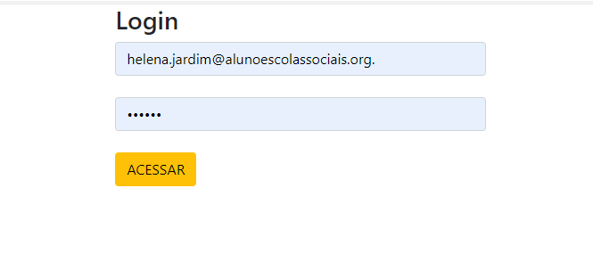
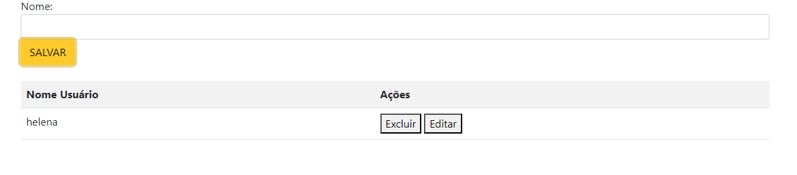
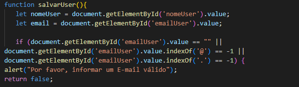
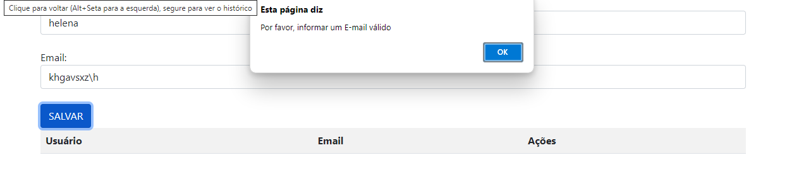
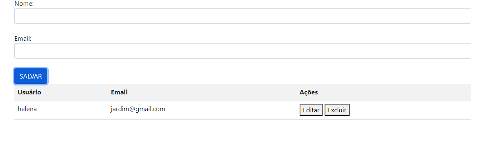

# login-cad

# CADASTRO

# Descrição Geral
O código cria uma página web para o cadastro de usuários. A estrutura inclui um campo de texto para inserir o nome de um usuário, um botão para salvar esse nome, e uma tabela para exibir os nomes cadastrados.

# Estrutura do Código
Cabeçalho da Página (<head>)

Codificação de Caracteres: O código define a codificação de caracteres como UTF-8 para garantir que todos os caracteres especiais sejam exibidos corretamente.
Compatibilidade com Navegadores: Especifica que o Internet Explorer deve usar o modo mais recente de renderização para garantir a compatibilidade.
Título da Página: Define o título que aparece na aba do navegador como "Cadastro".
Responsividade: Ajusta a visualização da página em dispositivos móveis, fazendo com que ela se adapte ao tamanho da tela.
Estilos e Scripts: Inclui um arquivo CSS (main.css) para personalização visual e um arquivo JavaScript (main.js) para funcionalidades adicionais. Além disso, o Bootstrap é adicionado via CDN para fornecer uma estilização responsiva e consistente com menos esforço.
Conteúdo da Página (<body>)

Campo de Entrada e Botão:
Há um campo de texto onde os usuários podem digitar seu nome.
Um botão "SALVAR" permite que o usuário envie o nome. Quando clicado, o botão chama uma função JavaScript chamada salvarUser(), que deve ser definida em um arquivo JavaScript separado (controller.js).
Tabela de Exibição:
Abaixo do campo de entrada, uma tabela exibe os nomes dos usuários que foram salvos. Esta tabela é inicialmente vazia e é estilizada com as classes table e table-striped do Bootstrap para uma aparência mais limpa e organizada.
As colunas da tabela são "Nome Usuario" e "Ações". A coluna de "Ações" está destinada a adicionar funcionalidades futuras, como editar ou excluir entradas.
Arquivos Externos
main.css: Este arquivo é usado para adicionar estilos personalizados que não estão cobertos pelo Bootstrap.
main.js: O código JavaScript adicional pode ser adicionado aqui para outras funcionalidades, embora não esteja especificado no código fornecido.
controller.js: Este é o arquivo onde a função salvarUser() deve ser implementada. Essa função é responsável por adicionar o nome inserido à tabela.

# Funcionamento

Inserção de Dados: O usuário insere um nome no campo de texto e clica no botão "SALVAR".
Salvamento e Exibição: A função salvarUser() (que deve ser implementada no arquivo controller.js) é chamada quando o botão é clicado. Essa função deve capturar o texto inserido, adicioná-lo à tabela e limpar o campo de entrada para novos dados.
A estrutura e a funcionalidade da página são projetadas para serem simples e diretas, permitindo ao usuário adicionar e visualizar dados de forma eficiente. 

# LOGIN

# Descrição Geral
Este código HTML define uma página de login onde o usuário pode inserir um e-mail e uma senha e, ao clicar em um botão, executar uma função para processar essas informações. O design utiliza o Bootstrap para estilização e uma abordagem responsiva.

# Estrutura do Código
Cabeçalho da Página (head)

Codificação de Caracteres: meta charset='utf-8' garante que o texto seja exibido corretamente com a codificação UTF-8.
Compatibilidade com Navegadores: meta http-equiv='X-UA-Compatible' content='IE=edge' assegura que o Internet Explorer use a versão mais recente do seu motor de renderização.
Título da Página: title define o título da página como "Login", que aparece na aba do navegador.
Responsividade: meta name='viewport' content='width=device-width, initial-scale=1' ajusta o layout da página para diferentes tamanhos de tela, especialmente em dispositivos móveis.
Estilos e Scripts:
CSS: link rel='stylesheet' type='text/css' media='screen' href='main.css' inclui um arquivo CSS externo (main.css) para estilização personalizada.
JavaScript: script src='main.js' inclui um arquivo JavaScript (main.js) para funcionalidades adicionais
 rel="stylesheet" inclui o Bootstrap via CDN para estilos e layout responsivo.
Corpo da Página (body)

Container Principal:
div class="container col-4": Utiliza classes do Bootstrap para definir um contêiner com uma largura de 4 colunas no grid system, centralizando o conteúdo da página.
Título: h3Login/h3 exibe um título de nível 3 para a página.
Campos de Entrada:
E-mail: input type="text" id="loginEmail" class="form-control" cria um campo de texto para o e-mail do usuário, estilizado com a classe form-control do Bootstrap.
Senha: input type="password" id="loginSenha" class="form-control" cria um campo de entrada para a senha, também estilizado com a classe form-control do Bootstrap. O tipo "password" oculta o texto digitado.
Botão: button onclick="acessar()" type="button" class="btn btn-warning" ACESSAR /button define um botão que, ao ser clicado, executa a função acessar(), estilizado com a classe btn btn-warning do Bootstrap para um visual de botão de alerta.
JavaScript:

script src='controller.js' /script : Inclui um arquivo JavaScript externo (controller.js) onde a função acessar() deve ser implementada para processar os dados inseridos pelo usuário.

# Funcionamento

Entrada de Dados:

O usuário insere o e-mail no campo de texto e a senha no campo de senha.
Ação do Botão:

Ao clicar no botão "ACESSAR", a função acessar() é chamada. Essa função deve ser definida no arquivo controller.js e é responsável por processar ou validar as informações inseridas pelo usuário.
Estilização:

O layout é gerenciado pelo Bootstrap, o que garante que a página tenha um design moderno e responsivo, adaptando-se bem a diferentes tamanhos de tela.

# CONTROLLER JS

# Array

var dadosLista = [];
Aqui, dadosLista é um array vazio criado para armazenar os nomes dos usuários que serão inseridos.

function salvarUser(){
    let nomeUser = document.getElementById('nomeUser').value;
 
    if(nomeUser){
        dadosLista.push(nomeUser);
        console.log(dadosLista);
        criarLista();
        document.getElementById('nomeUser').value = "";
    }
    else{
        alert("Favor informar o nome");
    }
}
nomeUser é obtido do campo de entrada do usuário.
Se nomeUser não estiver vazio, o nome é adicionado ao array dadosLista com dadosLista.push(nomeUser).
A função criarLista() é chamada para atualizar a exibição da lista.
O campo de entrada é limpo após adicionar o nome.

function criarLista(){
    let tabela = document.getElementById('tabela').innerHTML = "<tr><th>Nome Usuário</th><th>Ações</th></tr>";
    for(let i = 0; i <= (dadosLista.length -1); i++){ 
        tabela += "<tr><td>" + dadosLista[i] + "</td><td>  <button onclick='excluir(this.parentNode.parentNode.rowIndex)'>Excluir</button> <button onclick='editar(this.parentNode.parentNode.rowIndex)'>Editar</button> </td></tr>";
        document.getElementById('tabela').innerHTML = tabela;
    }
}
tabela começa com um cabeçalho para a tabela.
O for itera sobre dadosLista, criando uma linha na tabela para cada nome no array.
Cada linha inclui dois botões: "Excluir" e "Editar", que chamam as funções excluir e editar, respectivamente.
Após adicionar todas as linhas, o conteúdo da tabela é atualizado.

function excluir(i){
    dadosLista.splice((i - i), 1);
    document.getElementById('tabela').deleteRow(i);
}
A função usa splice para remover um elemento do array dadosLista. 

function editar(i){
    document.getElementById("nomeUser").value = dadosLista[(i - 1)];
    dadosLista.splice(dadosLista[(i - 1)], 1);
}
A função define o valor do campo de entrada nomeUser para o nome correspondente no array.
A tentativa de remover o nome do array usa splice.

O método splice() altera o conteúdo de uma lista, adicionando novos elementos enquanto remove elementos antigos.

# Função de Validação de Login (acessar)
Esta função verifica se os campos de e-mail e senha foram preenchidos corretamente. Quando o usuário clica no botão "ACESSAR":

A função acessar() obtém os valores dos campos de e-mail e senha.
Se qualquer um dos campos estiver vazio, a função exibe um alerta solicitando que todos os campos sejam preenchidos.
Se ambos os campos estiverem preenchidos, a função exibe um alerta de sucesso e redireciona o navegador para a página cadastro.html, que é onde o usuário pode gerenciar dados adicionais.
# Função de Salvamento de Usuários (salvarUser)
Esta função é responsável por adicionar novos nomes à lista de usuários e atualizar a tabela exibida na página:

Quando o usuário insere um nome e clica em um botão para salvar:
A função salvarUser() captura o nome inserido.
Se o campo não estiver vazio, o nome é adicionado à lista dadosLista e a tabela é atualizada para refletir a nova entrada.
O campo de entrada é limpo para permitir a inserção de um novo nome.
Se o campo estiver vazio, a função exibe um alerta solicitando que o nome seja informado.
# Função de Criação da Lista (criarLista)
Esta função atualiza a tabela HTML para exibir os nomes armazenados na lista:

A função criarLista() começa definindo o cabeçalho da tabela.
Em seguida, ela itera sobre cada nome na lista dadosLista e cria uma linha na tabela para cada nome.
Cada linha inclui botões "Excluir" e "Editar" que permitem ao usuário remover ou modificar o nome correspondente.
A tabela é atualizada com essas novas linhas, refletindo a lista atualizada de nomes.
# Função para Excluir Usuário (excluir)
Esta função remove um nome específico da lista e da tabela:

Quando o usuário clica no botão "Excluir" para um nome:
A função excluir(i) usa o índice da linha para determinar qual item deve ser removido.
O item é removido da lista dadosLista e a linha correspondente é deletada da tabela HTML.
Nota: Há um erro na função excluir. O código atual não remove corretamente o item da lista. A linha correta deve ser dadosLista.splice(i, 1) para remover o item correto.

# Função para Editar Usuário (editar)
Esta função permite ao usuário editar um nome existente na lista:

Quando o usuário clica no botão "Editar":
A função editar(i) preenche o campo de entrada com o nome selecionado para edição.
O nome é removido da lista dadosLista, permitindo ao usuário fazer alterações e salvá-lo novamente.
Nota: Há um erro na função editar. O código atual não remove corretamente o item da lista. A linha correta deve ser dadosLista.splice(i, 1).

Resumo
acessar(): Valida os campos de login e, se preenchidos, redireciona para uma nova página.
salvarUser(): Adiciona um nome à lista e atualiza a tabela de usuários.
criarLista(): Gera a tabela HTML com os nomes da lista, incluindo botões para ações de edição e exclusão.
excluir(): Remove um nome da lista e da tabela com base no índice da linha.
editar(): Permite a edição de um nome existente, preenchendo o campo de entrada com o nome selecionado e removendo-o da lista.

# IMAGENS DO PROJETO

# Validação de E-mail
Este fragmento de código JavaScript realiza uma verificação básica para validar se um campo de entrada de e-mail está preenchido corretamente antes de prosseguir com uma ação.

# Descrição
O código verifica se o campo de e-mail identificado pelo ID emailUser contém um e-mail válido. A validação é feita verificando três condições:

Se o campo está vazio.
Se o campo contém o caractere @.
Se o campo contém o caractere ..
Se qualquer uma dessas condições não for atendida, um alerta será exibido solicitando que o usuário informe um e-mail válido. A função retorna false para evitar o envio ou a continuação do processo quando o e-mail não é considerado válido.
 
Objetivo: Verificar se o campo de e-mail não está vazio e contém os caracteres básicos @ e . para garantir um formato de e-mail mínimo.

Passos da Validação:

Verificar se o campo está vazio:
document.getElementById('emailUser').value == ""
Se o campo estiver vazio, o código exibe uma mensagem de alerta.
Verificar a presença do caractere @:
document.getElementById('emailUser').value.indexOf('@') == -1
Se o caractere @ não estiver presente no valor do campo, o código exibe uma mensagem de alerta.
Verificar a presença do caractere .:
document.getElementById('emailUser').value.indexOf('.') == -1
Se o caractere . não estiver presente no valor do campo, o código exibe uma mensagem de alerta.
Ação em Caso de Validação Falha:

Se qualquer uma das condições de validação falhar, o código exibe um alerta com a mensagem "Por favor, informar um E-mail válido".
O return false; impede o envio do formulário ou a execução da ação subsequente até que o e-mail válido seja fornecido.

       if (document.getElementById('emailUser').value == "" ||
    document.getElementById('emailUser').value.indexOf('@') == -1 ||
    document.getElementById('emailUser').value.indexOf('.') == -1) {
    alert("Por favor, informar um E-mail válido");
    return false;
  } 

# IMAGENS DA MODIFICAÇÃO DO EMAIL

